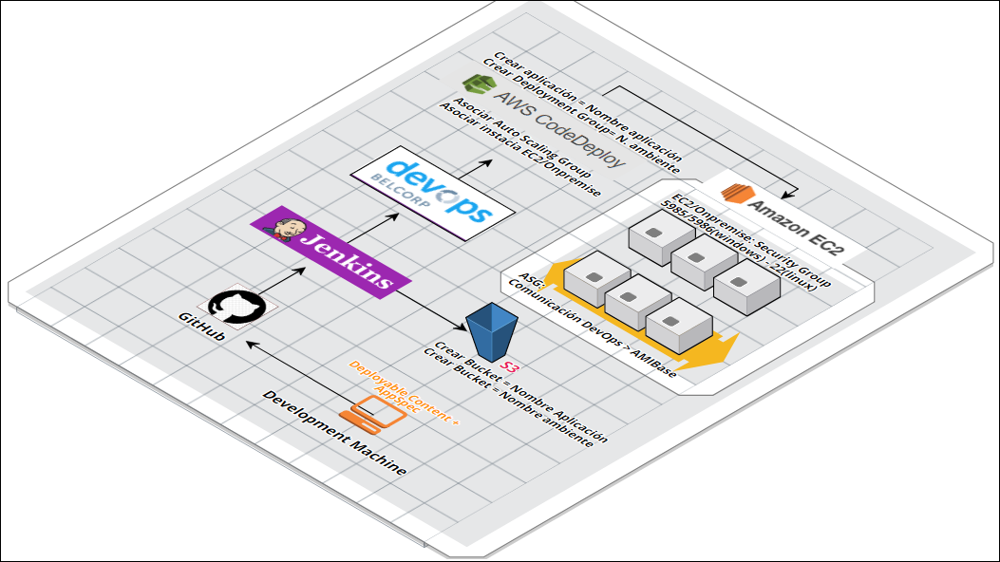
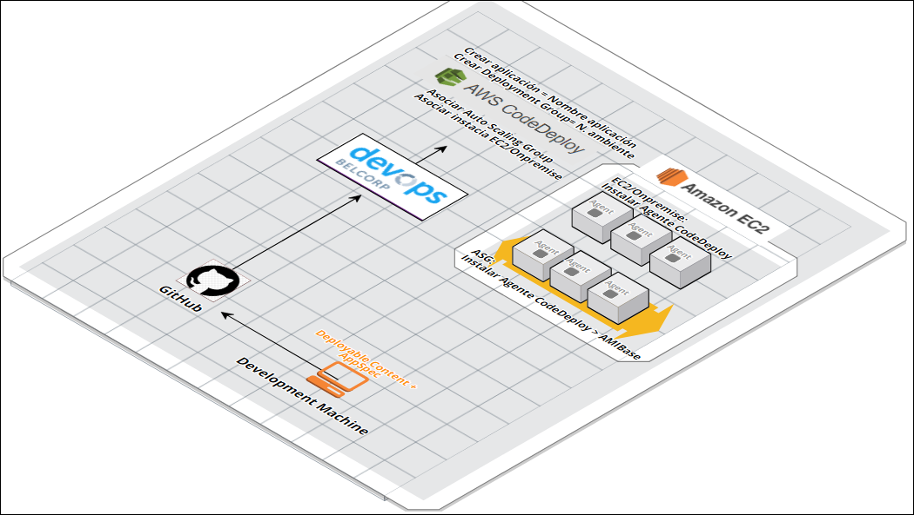
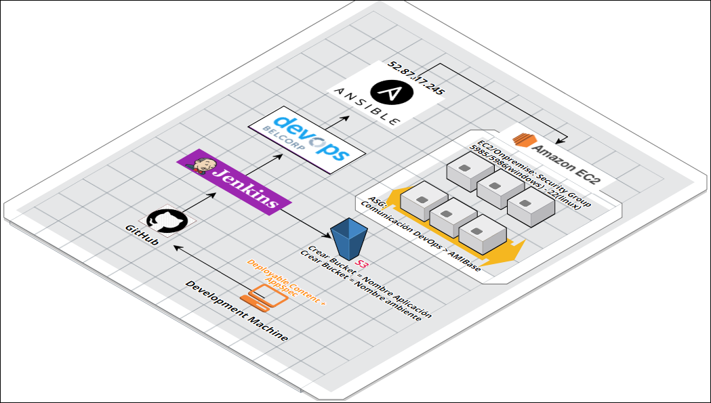

Despliegues Continuos
=====================

Diagrama Flujo de Integración
-----------------------------

Soluciones .NET

  
  
Soluciones PHP

    
Soluciones .NET (Ansible)

  
  
  
Como Configurar CodeDeploy
--------------------------

Para desplegar utilizando CodeDeploy necesitamos que las instancias cuenten con los roles correctos.

Requerimientos para proyecto:

* Instancia EC2 basada AMI
* Bucket S3 (Proyectos .Net )
* Rol para CodeDeploy
* Rol para instancia 

Rol para CodeDeploy: Ref. `Rol CodeDeploy <http://docs.aws.amazon.com/codedeploy/latest/userguide/how-to-create-service-role.html#how-to-create-service-role-console>`__

Considerar:
Crear rol con la política necesaria para acceder al Bucket S3 que se utilizará para despliegues
Asociar rol al crear instancia o Launch configuration (AutoScaling Group). Si se trata de una instancia ya existente asociar el rol correspondiente y/o atachar la politica necesaria.

Ejemplo Rol:

.. code:: json

  {
    "Version": "2012-04-01",
    "Statement": [
      {
        "Effect": "Allow",
        "Action": [
          "s3:Get*",
          "s3:List*"
        ],
        "Resources": [
          "arn:aws:s3:::CodeDeployDemoBucket/despliegues/*",
          "arn:aws:s3:::aws-codedeploy-use-east-1/*",
          "arn:aws:s3:::aws-codedeploy-use-west-2/*"
        ]
      }
    ]
  }

.. note:: Si instancia carece de asociación de rol; imposibilitará los despliegues en CodeDeploy.

Instalar el agente CodeDeploy
-----------------------------

Para desplegar utilizando CodeDeploy es necesario instalar el agente CodeDeploy. Aquí los detalles:

.. list-table:: 
  :widths: 25 25 50
  :header-rows: 1

  * - Nombre de la región
    - Sustitución de bucket-name
    - Identificador de la región
  * - EE.UU. Este (Ohio)
    - aws-codedeploy-us-east-2
    - us-east-2
  * - US East (N. Virginia)
    - aws-codedeploy-us-east-1
    - us-east-1
  * - EE.UU. Oeste (Norte de California)
    - aws-codedeploy-us-west-1
    - us-west-1
  * - EE.UU. Oeste (Oregón)
    - aws-codedeploy-us-west-2
    - us-west-2
  * - Canadá (Central)
    - aws-codedeploy-ca-central-1
    - ca-central-1
  * - UE (Irlanda)
    - aws-codedeploy-eu-west-1
    - eu-west-1
  * - UE (Londres)
    - aws-codedeploy-eu-west-2
    - eu-west-2
  * - UE (Fráncfort)
    - aws-codedeploy-eu-central-1
    - eu-central-1
  * - Asia Pacífico (Tokio)
    - aws-codedeploy-ap-northeast-1
    - ap-northeast-1
  * - Asia Pacífico (Seúl)
    - aws-codedeploy-ap-northeast-2
    - ap-northeast-2
  * - Asia Pacífico (Singapur)
    - aws-codedeploy-ap-southeast-1
    - ap-southeast-1
  * - Asia Pacífico (Sídney)
    - aws-codedeploy-ap-southeast-2
    - ap-southeast-2
  * - Asia Pacífico (Mumbai)
    - aws-codedeploy-ap-south-1
    - ap-south-1
  * - América del Sur (São Paulo)
    - aws-codedeploy-sa-east-1
    - sa-east-1
