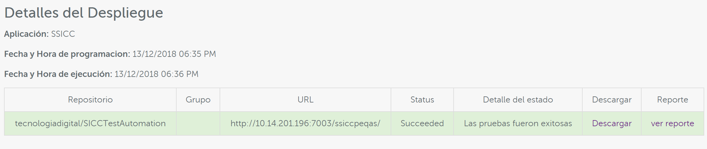

Codecept
==========

Configuración e integración en Devops
^^^^^^^^^^^^^^^^^^^^^^^^^^^^^^^^^^^^^

1. Crear repositorio en github. (e.g: https://github.com/{user_acc}/{proyect_name}_TestAutomation)
2. Subir archivos correspondientes a las pruebas de Codecept en el repositorio creado.

.. note:: Se recomienda tener al menos una prueba, al menos la de validacion del site.
          o home de la web o aplicación

3. En Devops se debe registrar el repositorio en la opcion de **repositorio de calidad** mostrado en la pantalla del formulario
   de la aplicación

.. figure:: ../_static/images/codecept1.png
  :align: center
  :figwidth: 500px
  :target: ../_static/images/codecept1.png
  
  
Programación Prueba en DevOps
^^^^^^^^^^^^^^^^^^^^^^^^^^^^^^^^^^^^^
  
1. Como usuario programar una prueba a demanda
  

  
2. Aprobar el ticket
3. Visualizar la ejecución en el Dashboard de DevOps
  

  
  En esta imagen muestra 2 diferentes opciones **Descargar** y **Ver reporte**
  
  En la opcion de Ver reporte, se visualiza la informacion detallada de las pruebas realizadas, como el estatus de cada una.

  En la opcion Descargar, se descargan todos los archivos de prueba que incluyen las imágenes que se tomaron durante la prueba:
  

  