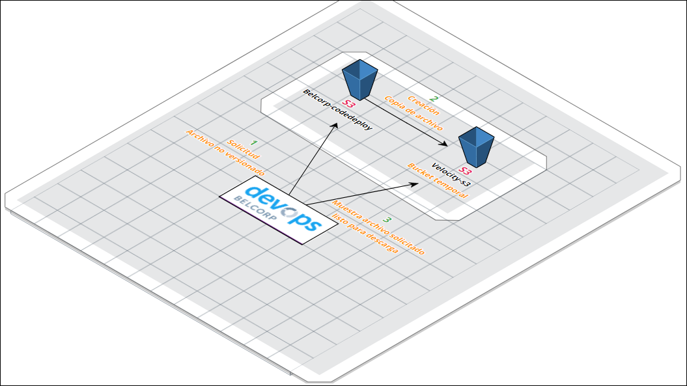
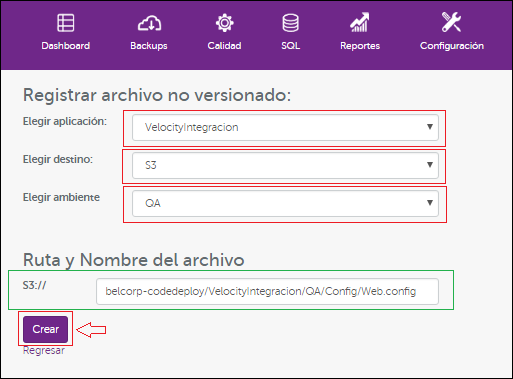
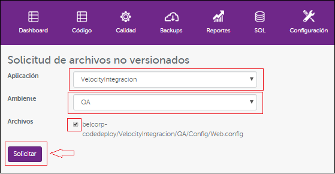
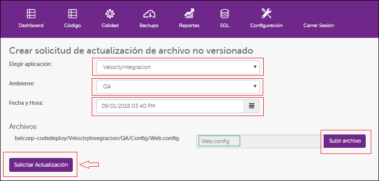

Archivos no versionados
=======================

Los archivos no versionados son administrados desde el módulo en DevOps con el mismo nombre, 
por seguridad u otras consideraciones los archivos se suben al Bucket S3 y son solicitados (script del proyecto)
desde aquí al momento de ejecutar un despliegue automático. Para el caso de la subida y/o actualización del mismo 
se debe realizar desde este módulo.

Estructura -  Flujo de Solicitud
--------------------------------

    
Registro Archivo no versionado
------------------------------

Como registrar un archivo no versionado en Devops

Como solicitar archivos no versionados en Devops

Como crear solicitud de archivos no versionados en Devops

